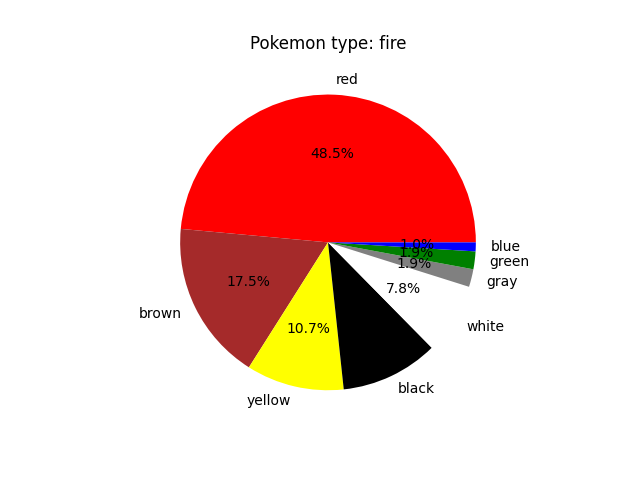
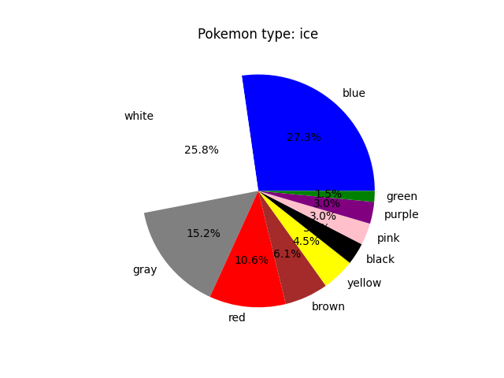

# Pokèmon insights
**How many percent of all pokemons of type 'fire' are red compared to green, blue or any other color?**
That's what the project contained in this repo tries to find out!
By fetching all the data from the pokeapi into a duckdb database, transforming the data using dbt into a clean, well structured table suitable for our task, we finally produce insights into how the color of the pokèmons relate to its type.

<p float="left">
  
  
</p>


### How to run the code:

1. Clone repository:
```bash
git clone https://github.com/coffeeBeansz/pokemon_insights.git
```

2. Install python and pip:
```bash
sudo apt install python3, python3-pip
```

3. Create a virtual environment and install the requirements to it:
```bash
pip install -r requirements.txt
```

4. Put a file named profiles.yml in the folder ~/.dbt/ conatining the following:
```bash
dbt_project:
  outputs:
    dev:
      type: duckdb
      path: <path_to_repo>/pokeapi_database.duckdb
      threads: 1

    prod:
      type: duckdb
      path: <path_to_repo>/pokeapi_database.duckdb
      threads: 4

  target: dev
  ```
  where <path_to_repo> should be replaced by the path to the github repo on your computer.

5. To fetch raw data from pokeapi, cd to repo and run:
```bash
python3 extract_raw.py
```

6. To prepare the data, cd to the dbt_project inside your repo and run:
```bash
dbt run
```

7. To create the insights, cd to repo and run:
```bash
python3 main.py
```
The folder result_figures will be created, and the insights are placed in this folder.